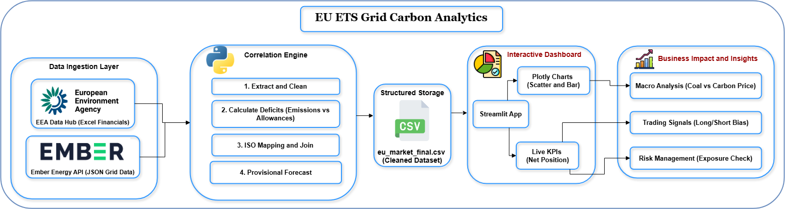

# ⚡ EU ETS Grid Carbon Analytics
<!-- PROJECT TITLE PAGE -->


---
### 📖 Executive Summary
The **EU ETS Grid Carbon Analytics** engine is a data pipeline and dashboard designed to uncover the hidden correlation between **Physical Energy Fundamentals** (Grid Generation) and **Financial Carbon Compliance** (EU ETS Deficits).

By merging disparate datasets—official registry compliance logs (Excel) and live grid generation APIs (JSON)—this tool allows analysts to visualize how renewable intermittency (Low Wind/Solar) drives fossil fuel reliance, thereby increasing the demand for European Union Allowances (EUAs).

---

### 💼 Business Use Case

#### 1. The "Merit Order" Correlation
In European power markets, the "Merit Order" dictates that cheaper renewables run first. When Wind/Solar output drops, the grid shifts to the marginal producer: usually **Coal or Gas**.
*   **The Problem:** Coal is approximately 2x more carbon-intensive than Gas.
*   **The Insight:** A "Dunkelflaute" (dark doldrums: low wind/solar) forces a spike in Coal generation. This project quantifies exactly how much that physical shift impacts the financial "Carbon Deficit" of major utilities.

#### 2. Value Proposition for Stakeholders
*   **📉 For Commodities Traders (Alpha Generation):**
    *   Identifies **Structural Shorts**: If a country like Germany or Poland shows a widening gap between verified emissions and free allowances *correlated* with a 15% rise in Coal burn, it signals strong buying pressure for Carbon Credits (EUAs).
    *   **Signal:** High Coal Load + High Deficit = **Bullish Price Signal**.

*   **📊 For Energy Analysts (Fundamental Analysis):**
    *   Validates whether a compliance deficit is "structural" (grid constraints requiring dirty power) or "transitional" (temporary economic activity).
    *   Helps predict EUA demand before official yearly reports are released by tracking monthly grid intensity.

*   **🛡️ For Risk Managers:**
    *   Visualizes exposure. If a portfolio is short Carbon, and the tool forecasts a high-coal winter based on grid trends, hedging strategies can be adjusted early.
---

## 🏗️ Project Architecture



---

## 📊 Dashboard & Analysis Report

📄 **Interactive Dashboard Report:**  
[Open Dashboard PDF](assets/images/dashboard.pdf)

--
### 📊 Data Sources

The pipeline aggregates data from two official sources to create a unified view of the European Carbon Market:

1.  **Financial Compliance Data (EU ETS):**

    *   *Source:* [European Environment Agency (EEA) Data Hub](https://www.eea.europa.eu/en/datahub/datahubitem-view/98f04097-26de-4fca-86c4-63834818c0c0)

    *   *Metric:* Verified Emissions, Freely Allocated Allowances, Surrendered Units.

2.  **Physical Grid Data:**

    *   *Source:* [Ember Energy - Yearly Electricity Data](https://ember-energy.org/data/yearly-electricity-data/)

    *   *Metric:* TWh Generation by Fuel (Coal, Lignite, Gas, Nuclear, Renewables).

---

### 🚀 Key Features

*   **ETL Pipeline:** Extracts Excel data from EEA and enriches it with live API calls to Ember.

*   **Smart Join Logic:** Maps ISO3 Country Codes (API) to ETS Registry Names (Excel) to ensure accurate merging of disparate datasets.

*   **Deficit Calculation:** Automatically calculates `Net Carbon Position = Verified Emissions - Free Allowances`.

*   **Provisional Forecasting:** Generates 2024-2025 provisional data estimates based on EU Phase 4 reduction trends (if official registry data is delayed).

*   **Interactive Dashboard:** Streamlit app with Plotly visualizations to analyze "Top Buyers" and "Correlation Scatter Plots".

---

## 🛠️ Setup & Installation

### 1️⃣ Clone the Repository

```bash
git clone https://github.com/sameerhussai230/EU-ETS-Grid-Carbon-Analytics.git
cd EU-ETS-Grid-Carbon-Analytics
```

### 2️⃣ Create a Virtual Environment

```bash
python -m venv venv
```

```bash
venv\Scripts\activate
```

```bash
source venv/bin/activate
```

### 3️⃣ Install Dependencies

```bash
pip install -r requirements.txt
```

### 4️⃣ Environment Variables

Create a `.env` file in the root directory and add your Ember API key:

```env
EMBER_API_KEY= api_key
```

---

## ▶️ Usage

### 1️⃣ Run the ETL Pipeline

Process raw Excel data and fetch the latest grid stats:

```bash
python main.py
```

### 2️⃣ Launch the Dashboard

Start the local analytics server:

```bash
streamlit run app.py
```

## 📜 Data Attribution & Licensing

This project leverages open data to provide insights into the European carbon market. We gratefully acknowledge the following organizations for making their data publicly available:

| Source | Data Content | License |
| :--- | :--- | :--- |
| **[European Environment Agency (EEA)](https://www.eea.europa.eu/)** | EU ETS Financial Compliance (Emissions, Allocations) | [CC BY 4.0](https://creativecommons.org/licenses/by/4.0/) |
| **[Ember](https://ember-energy.org/)** | Yearly Electricity Generation & Grid Mix | [CC BY-SA 4.0](https://creativecommons.org/licenses/by-sa/4.0/) |

### ⚖️ Disclaimer
This repository is for **educational and research purposes only**. The analysis provided is a Proof of Concept (PoC) and should not be used as financial advice for trading European Emission Allowances (EUAs). While every effort is made to ensure data accuracy through the ETL pipeline, the authors are not responsible for any discrepancies in the source datasets.


